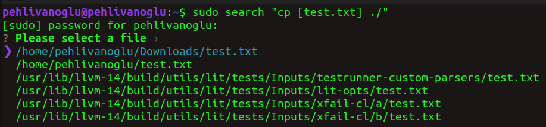
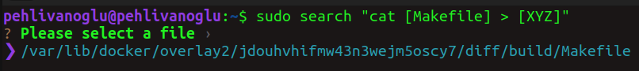
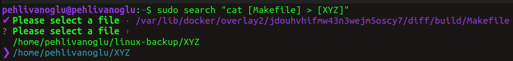
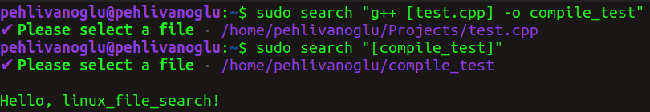

## File Search Utility
The File Search Utility is a command-line tool designed to facilitate file searching and management on Linux systems. The project aims to provide users with a powerful and flexible utility that allows users to perform operations on files whose exact directories are unknown but whose names are known, by simply specifying the file names.
## Build, Install, Use
### Prerequisites
1. Cargo and Rust, visit https://doc.rust-lang.org/cargo/getting-started/installation.html


### 1. Build/Compile
Make sure Cargo and Rust is installed. Then,

1. Open Linux terminal. (Ctrl+Alt+T)
2. Go to main directory (which is /linux_file_search).
3. Type ```cargo build --release``` to terminal.

### 2. Install

#### Installing Options
##### Setup Modes:
1. Minimal: Includes files from: /home, /bin, /usr, /root. \
```--setup_mode minimal```
2. Standard: Includes files from: /home, /bin, /usr, /var, /cdrom, /etc, /media, /sbin, /srv, /root  
```--setup_mode standard```
3. Maximal: Includes files from every directory except (excludes): /proc, /run, /lost+found, /tmp, /dev \
```--setup_mode maximal```
4. Custom: Includes files from directories listed with ``` --include ``` parameter. Example usage: ```--setup_mode custom --include /home/user/Desktop```


##### Include Option:
Includes files from directories listed with ``` --include ``` parameter.\
Example usage: ```--include /home/user/Downloads /var /home/user/Desktop```

##### Add Hidden Directories and Files Flag:
To add hidden directories and hidden files.\
Usage: ```--add_hidden```


#### Install with Database Setup Parameters
Type ```sudo ./target/release/setup --setup_mode <choose setup mode from installing options section> --include <desired dirs to add to database>```.\
If you want to add hidden directories and hidden files, also add ``` --add_hidden ``` flag.

#### Or, Install without Setup Mode (Minimal setup mode as default)
Type ```sudo ./target/release/setup```.\
If you want to add hidden directories and hidden files, also add ``` --add_hidden ``` flag.

#### Example Installation
```sudo ./target/release/setup --setup_mode custom --include /home/user/Downloads /var /home/user/Desktop```\
or \
```sudo ./target/release/setup --setup_mode standard --add_hidden```
#### Install Search Binary
Type ``` sudo cp ./target/release/search /usr/local/bin/  ```. \
Then, type ``` sudo chmod +x /usr/local/bin/search```


### 3. Daemonize and Automatize Database Updating (Crucial)
To ensure the database updating program runs automatically at regular intervals, you can use a cron job.
This example sets up the program to run every 30 minutes: 

```*/30 * * * * /path/to/linux_file_search/target/release/update```

*/30: This means the job will run every 30 minutes. The * means "every," and the /2 means "every 2 minutes."
*: The remaining asterisks represent the hour, day of the month, month, and day of the week, respectively.
The * in each position means "every" unit of time for that position.
Therefore, */30 * * * * translates to "run this job every 30 minutes."
1. Open terminal, type:
   ```sudo crontab -e```
2. Paste ```*/{x} * * * * /path/to/linux_file_search/target/release/update``` to end of the file.
> **_IMPORTANT:_** Replace {x} with your own choice, or you can use different methods daemonize. But if you do, modify src/update.rs according to your needs.


### 4. Usage
> **_IMPORTANT:_**  
> 1. Must be executed with sudo privileges. (sudo search ... )
> 2. Command to be executed must be given inside double quotes to search ( sudo search "..." )
> 3. Files to be searched must be written inside square brackets ( sudo search "some_command [filename1] [filename2]" )
Examples:
1. To copy a file named test.txt (whose name is known but path is unknown) to current working directory: \
```sudo search "cp [test.txt] ./" ```
If the program finds multiple test.txt files, it lists the all files named test.txt, then allows you to choose one.



2. To write the content of a file named Makefile (whose name is known but path is unknown) to another file named XYZ (whose name is known but path is unknown): \
   ```sudo search "cat [Makefile] > [XYZ]" ```
   If the program finds multiple Makefile and XYZ files, it lists the all files named Makefile and XYZ, then allows you to choose one.
   
   

3. To compile and execute a C++ source file named test.cpp (whose name is known but path is unknown): \
   ```sudo search "g++ [test.cpp] -o compile_test" ```
   ```sudo search "[compile_test]"```
   


## Automatically Generated Files:
1. Daemon files at /tmp
2. Config file at /etc/file_search/
3. Database files at /var/lib/file_search/


## Notes
1. All binaries must be executed as superuser since privileged file operations are executed.
2. Keeps filenames starting with special characters in a single database named _.db ( #, *, &, etc.)